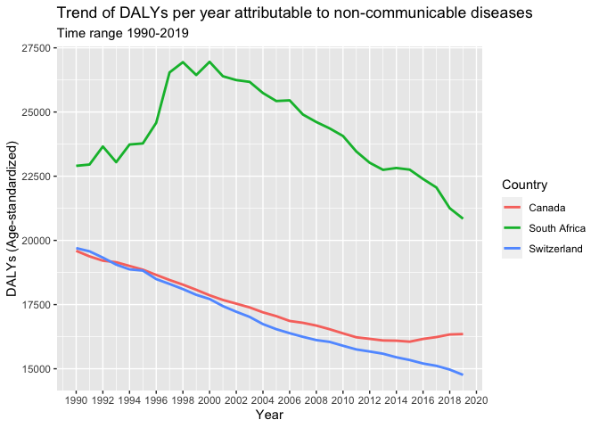

Global Disease Burden Analysis
================
Amy Mwanga, Tamara, Didier

# Introduction

This document compares the Disability-Adjusted Life Year (DALY) diseases
burden for three countries: Switzerland, Canada, and South Africa We
compare the burden due to communicable, maternal, neonatal, and
nutritional diseases (CMNN), non-communicable diseases (NCDs), and
overall disease burden for these countries.

The source data is from the Institute for Health Metrics and Evaluation
(IHME) Global Burden of Disease (GBD) study.

# Communicable, Maternal, Neonatal, and Nutritional Disease Burden (CMNN)

## Table of Estimates for CMNN Burden Over Time

<table>
<caption>
DALY Burden Over Time for Switzerland, Canada, and South Africa
</caption>
<thead>
<tr>
<th style="text-align:right;">
Year
</th>
<th style="text-align:right;">
Canada
</th>
<th style="text-align:right;">
South Africa
</th>
<th style="text-align:right;">
Switzerland
</th>
</tr>
</thead>
<tbody>
<tr>
<td style="text-align:right;">
1990
</td>
<td style="text-align:right;">
1628.468
</td>
<td style="text-align:right;">
21011.64
</td>
<td style="text-align:right;">
1499.9792
</td>
</tr>
<tr>
<td style="text-align:right;">
1991
</td>
<td style="text-align:right;">
1610.870
</td>
<td style="text-align:right;">
20646.69
</td>
<td style="text-align:right;">
1455.3930
</td>
</tr>
<tr>
<td style="text-align:right;">
1992
</td>
<td style="text-align:right;">
1612.841
</td>
<td style="text-align:right;">
20961.17
</td>
<td style="text-align:right;">
1417.3056
</td>
</tr>
<tr>
<td style="text-align:right;">
1993
</td>
<td style="text-align:right;">
1645.592
</td>
<td style="text-align:right;">
20733.49
</td>
<td style="text-align:right;">
1356.1228
</td>
</tr>
<tr>
<td style="text-align:right;">
1994
</td>
<td style="text-align:right;">
1657.691
</td>
<td style="text-align:right;">
21688.30
</td>
<td style="text-align:right;">
1304.4203
</td>
</tr>
<tr>
<td style="text-align:right;">
1995
</td>
<td style="text-align:right;">
1688.159
</td>
<td style="text-align:right;">
22983.17
</td>
<td style="text-align:right;">
1558.6748
</td>
</tr>
<tr>
<td style="text-align:right;">
1996
</td>
<td style="text-align:right;">
1606.021
</td>
<td style="text-align:right;">
25080.30
</td>
<td style="text-align:right;">
1465.5185
</td>
</tr>
<tr>
<td style="text-align:right;">
1997
</td>
<td style="text-align:right;">
1510.585
</td>
<td style="text-align:right;">
28394.88
</td>
<td style="text-align:right;">
1372.0308
</td>
</tr>
<tr>
<td style="text-align:right;">
1998
</td>
<td style="text-align:right;">
1459.720
</td>
<td style="text-align:right;">
32079.65
</td>
<td style="text-align:right;">
1313.2029
</td>
</tr>
<tr>
<td style="text-align:right;">
1999
</td>
<td style="text-align:right;">
1430.180
</td>
<td style="text-align:right;">
35567.27
</td>
<td style="text-align:right;">
1286.8233
</td>
</tr>
<tr>
<td style="text-align:right;">
2000
</td>
<td style="text-align:right;">
1411.585
</td>
<td style="text-align:right;">
39770.06
</td>
<td style="text-align:right;">
1282.4212
</td>
</tr>
<tr>
<td style="text-align:right;">
2001
</td>
<td style="text-align:right;">
1405.815
</td>
<td style="text-align:right;">
43351.42
</td>
<td style="text-align:right;">
1255.9620
</td>
</tr>
<tr>
<td style="text-align:right;">
2002
</td>
<td style="text-align:right;">
1404.138
</td>
<td style="text-align:right;">
47021.06
</td>
<td style="text-align:right;">
1215.3329
</td>
</tr>
<tr>
<td style="text-align:right;">
2003
</td>
<td style="text-align:right;">
1414.346
</td>
<td style="text-align:right;">
50314.47
</td>
<td style="text-align:right;">
1183.9231
</td>
</tr>
<tr>
<td style="text-align:right;">
2004
</td>
<td style="text-align:right;">
1409.524
</td>
<td style="text-align:right;">
52677.09
</td>
<td style="text-align:right;">
1171.4344
</td>
</tr>
<tr>
<td style="text-align:right;">
2005
</td>
<td style="text-align:right;">
1425.077
</td>
<td style="text-align:right;">
53721.19
</td>
<td style="text-align:right;">
1143.5562
</td>
</tr>
<tr>
<td style="text-align:right;">
2006
</td>
<td style="text-align:right;">
1400.238
</td>
<td style="text-align:right;">
53340.40
</td>
<td style="text-align:right;">
1143.1385
</td>
</tr>
<tr>
<td style="text-align:right;">
2007
</td>
<td style="text-align:right;">
1398.456
</td>
<td style="text-align:right;">
51198.48
</td>
<td style="text-align:right;">
1110.1040
</td>
</tr>
<tr>
<td style="text-align:right;">
2008
</td>
<td style="text-align:right;">
1385.593
</td>
<td style="text-align:right;">
48249.60
</td>
<td style="text-align:right;">
1094.4056
</td>
</tr>
<tr>
<td style="text-align:right;">
2009
</td>
<td style="text-align:right;">
1368.834
</td>
<td style="text-align:right;">
44284.14
</td>
<td style="text-align:right;">
1103.4031
</td>
</tr>
<tr>
<td style="text-align:right;">
2010
</td>
<td style="text-align:right;">
1364.836
</td>
<td style="text-align:right;">
40551.60
</td>
<td style="text-align:right;">
1069.5194
</td>
</tr>
<tr>
<td style="text-align:right;">
2011
</td>
<td style="text-align:right;">
1340.388
</td>
<td style="text-align:right;">
36923.92
</td>
<td style="text-align:right;">
1052.9461
</td>
</tr>
<tr>
<td style="text-align:right;">
2012
</td>
<td style="text-align:right;">
1332.894
</td>
<td style="text-align:right;">
33496.08
</td>
<td style="text-align:right;">
1041.5221
</td>
</tr>
<tr>
<td style="text-align:right;">
2013
</td>
<td style="text-align:right;">
1336.585
</td>
<td style="text-align:right;">
30854.99
</td>
<td style="text-align:right;">
1041.7970
</td>
</tr>
<tr>
<td style="text-align:right;">
2014
</td>
<td style="text-align:right;">
1315.221
</td>
<td style="text-align:right;">
29399.01
</td>
<td style="text-align:right;">
1036.2483
</td>
</tr>
<tr>
<td style="text-align:right;">
2015
</td>
<td style="text-align:right;">
1301.372
</td>
<td style="text-align:right;">
28383.47
</td>
<td style="text-align:right;">
1039.1022
</td>
</tr>
<tr>
<td style="text-align:right;">
2016
</td>
<td style="text-align:right;">
1294.945
</td>
<td style="text-align:right;">
27854.71
</td>
<td style="text-align:right;">
1005.3160
</td>
</tr>
<tr>
<td style="text-align:right;">
2017
</td>
<td style="text-align:right;">
1277.019
</td>
<td style="text-align:right;">
26968.94
</td>
<td style="text-align:right;">
993.0077
</td>
</tr>
<tr>
<td style="text-align:right;">
2018
</td>
<td style="text-align:right;">
1266.891
</td>
<td style="text-align:right;">
24952.88
</td>
<td style="text-align:right;">
981.4799
</td>
</tr>
<tr>
<td style="text-align:right;">
2019
</td>
<td style="text-align:right;">
1254.503
</td>
<td style="text-align:right;">
23778.37
</td>
<td style="text-align:right;">
972.5998
</td>
</tr>
</tbody>
</table>

## Plot Showing Trends in CMNN Burden Over Time

<!-- -->

## Summary of CMNN Burden Findings

There is a noticeable difference in the trend lines between the
countries. For instance, South Africa shows a higher and more volatile
DALY burden over the years compared to Switzerland and Canada,
indicating a greater impact of communicable, maternal, neonatal, and
nutritional diseases.In 2005 there’s a notable spikes in South Africa
highlight periods of health crises or gaps in disease control and
prevention, in this case HIV/AIDs).

# Non-Communicable Disease Burden (NCD)

## Table of Estimates for NCD Burden Over Time

<table>
<caption>
DALYs per Year for Canada, South Africa and Switzerland
</caption>
<thead>
<tr>
<th style="text-align:right;">
Year
</th>
<th style="text-align:right;">
Canada
</th>
<th style="text-align:right;">
South Africa
</th>
<th style="text-align:right;">
Switzerland
</th>
</tr>
</thead>
<tbody>
<tr>
<td style="text-align:right;">
1990
</td>
<td style="text-align:right;">
19593.93
</td>
<td style="text-align:right;">
22903.42
</td>
<td style="text-align:right;">
19700.25
</td>
</tr>
<tr>
<td style="text-align:right;">
1991
</td>
<td style="text-align:right;">
19377.91
</td>
<td style="text-align:right;">
22954.29
</td>
<td style="text-align:right;">
19573.97
</td>
</tr>
<tr>
<td style="text-align:right;">
1992
</td>
<td style="text-align:right;">
19209.89
</td>
<td style="text-align:right;">
23656.98
</td>
<td style="text-align:right;">
19329.69
</td>
</tr>
<tr>
<td style="text-align:right;">
1993
</td>
<td style="text-align:right;">
19149.74
</td>
<td style="text-align:right;">
23047.14
</td>
<td style="text-align:right;">
19057.08
</td>
</tr>
<tr>
<td style="text-align:right;">
1994
</td>
<td style="text-align:right;">
19003.90
</td>
<td style="text-align:right;">
23733.88
</td>
<td style="text-align:right;">
18870.66
</td>
</tr>
<tr>
<td style="text-align:right;">
1995
</td>
<td style="text-align:right;">
18860.08
</td>
<td style="text-align:right;">
23777.26
</td>
<td style="text-align:right;">
18824.10
</td>
</tr>
<tr>
<td style="text-align:right;">
1996
</td>
<td style="text-align:right;">
18655.65
</td>
<td style="text-align:right;">
24580.75
</td>
<td style="text-align:right;">
18492.36
</td>
</tr>
<tr>
<td style="text-align:right;">
1997
</td>
<td style="text-align:right;">
18457.68
</td>
<td style="text-align:right;">
26541.82
</td>
<td style="text-align:right;">
18303.29
</td>
</tr>
<tr>
<td style="text-align:right;">
1998
</td>
<td style="text-align:right;">
18276.44
</td>
<td style="text-align:right;">
26941.39
</td>
<td style="text-align:right;">
18103.51
</td>
</tr>
<tr>
<td style="text-align:right;">
1999
</td>
<td style="text-align:right;">
18076.19
</td>
<td style="text-align:right;">
26441.48
</td>
<td style="text-align:right;">
17880.32
</td>
</tr>
<tr>
<td style="text-align:right;">
2000
</td>
<td style="text-align:right;">
17862.21
</td>
<td style="text-align:right;">
26954.15
</td>
<td style="text-align:right;">
17717.36
</td>
</tr>
<tr>
<td style="text-align:right;">
2001
</td>
<td style="text-align:right;">
17679.90
</td>
<td style="text-align:right;">
26393.08
</td>
<td style="text-align:right;">
17440.60
</td>
</tr>
<tr>
<td style="text-align:right;">
2002
</td>
<td style="text-align:right;">
17536.40
</td>
<td style="text-align:right;">
26243.70
</td>
<td style="text-align:right;">
17220.86
</td>
</tr>
<tr>
<td style="text-align:right;">
2003
</td>
<td style="text-align:right;">
17390.18
</td>
<td style="text-align:right;">
26175.20
</td>
<td style="text-align:right;">
17020.54
</td>
</tr>
<tr>
<td style="text-align:right;">
2004
</td>
<td style="text-align:right;">
17198.10
</td>
<td style="text-align:right;">
25739.70
</td>
<td style="text-align:right;">
16739.51
</td>
</tr>
<tr>
<td style="text-align:right;">
2005
</td>
<td style="text-align:right;">
17049.11
</td>
<td style="text-align:right;">
25428.15
</td>
<td style="text-align:right;">
16542.08
</td>
</tr>
<tr>
<td style="text-align:right;">
2006
</td>
<td style="text-align:right;">
16861.82
</td>
<td style="text-align:right;">
25454.41
</td>
<td style="text-align:right;">
16385.49
</td>
</tr>
<tr>
<td style="text-align:right;">
2007
</td>
<td style="text-align:right;">
16789.43
</td>
<td style="text-align:right;">
24901.25
</td>
<td style="text-align:right;">
16243.25
</td>
</tr>
<tr>
<td style="text-align:right;">
2008
</td>
<td style="text-align:right;">
16682.26
</td>
<td style="text-align:right;">
24610.46
</td>
<td style="text-align:right;">
16117.06
</td>
</tr>
<tr>
<td style="text-align:right;">
2009
</td>
<td style="text-align:right;">
16539.79
</td>
<td style="text-align:right;">
24361.90
</td>
<td style="text-align:right;">
16046.18
</td>
</tr>
<tr>
<td style="text-align:right;">
2010
</td>
<td style="text-align:right;">
16379.09
</td>
<td style="text-align:right;">
24065.55
</td>
<td style="text-align:right;">
15896.66
</td>
</tr>
<tr>
<td style="text-align:right;">
2011
</td>
<td style="text-align:right;">
16225.64
</td>
<td style="text-align:right;">
23461.90
</td>
<td style="text-align:right;">
15752.85
</td>
</tr>
<tr>
<td style="text-align:right;">
2012
</td>
<td style="text-align:right;">
16165.93
</td>
<td style="text-align:right;">
23024.66
</td>
<td style="text-align:right;">
15672.35
</td>
</tr>
<tr>
<td style="text-align:right;">
2013
</td>
<td style="text-align:right;">
16102.23
</td>
<td style="text-align:right;">
22748.43
</td>
<td style="text-align:right;">
15586.22
</td>
</tr>
<tr>
<td style="text-align:right;">
2014
</td>
<td style="text-align:right;">
16093.64
</td>
<td style="text-align:right;">
22819.93
</td>
<td style="text-align:right;">
15446.93
</td>
</tr>
<tr>
<td style="text-align:right;">
2015
</td>
<td style="text-align:right;">
16054.63
</td>
<td style="text-align:right;">
22755.45
</td>
<td style="text-align:right;">
15340.48
</td>
</tr>
<tr>
<td style="text-align:right;">
2016
</td>
<td style="text-align:right;">
16161.82
</td>
<td style="text-align:right;">
22391.78
</td>
<td style="text-align:right;">
15204.87
</td>
</tr>
<tr>
<td style="text-align:right;">
2017
</td>
<td style="text-align:right;">
16233.64
</td>
<td style="text-align:right;">
22060.71
</td>
<td style="text-align:right;">
15114.28
</td>
</tr>
<tr>
<td style="text-align:right;">
2018
</td>
<td style="text-align:right;">
16335.44
</td>
<td style="text-align:right;">
21254.27
</td>
<td style="text-align:right;">
14967.97
</td>
</tr>
<tr>
<td style="text-align:right;">
2019
</td>
<td style="text-align:right;">
16352.54
</td>
<td style="text-align:right;">
20844.50
</td>
<td style="text-align:right;">
14760.75
</td>
</tr>
</tbody>
</table>

## Plot Showing Trends in NCD Burden Over Time

<!-- -->

## Summary of NCD Burden Findings

In the data we see an overall decline in disability-adjusted life years
in all three countries. While this decline has been continously
observable since 1990 for Switzerland, Canada has stable numbers since
2015 after an initial decline. In contrast, South Africa has seen an
initial increase between 1990 and 2000 with a continous decline since
then.

# Overall Disease Burden

## Table of Estimates for Overall Disease Burden Over Time

| Year |   Canada | South Africa | Switzerland |
|-----:|---------:|-------------:|------------:|
| 1990 | 24247.51 |     53698.07 |    24919.07 |
| 1991 | 23945.82 |     53230.09 |    24757.26 |
| 1992 | 23714.16 |     54544.20 |    24419.98 |
| 1993 | 23642.44 |     52947.56 |    23997.29 |
| 1994 | 23450.78 |     54591.37 |    23676.55 |
| 1995 | 23278.25 |     55667.82 |    23670.78 |
| 1996 | 22934.07 |     58201.69 |    23103.09 |
| 1997 | 22589.91 |     64023.20 |    22751.97 |
| 1998 | 22315.44 |     68245.40 |    22410.23 |
| 1999 | 22045.29 |     70974.39 |    22109.41 |
| 2000 | 21747.44 |     75846.52 |    21917.00 |
| 2001 | 21524.03 |     78606.11 |    21556.59 |
| 2002 | 21343.27 |     82184.82 |    21198.29 |
| 2003 | 21177.78 |     85486.87 |    20881.83 |
| 2004 | 20944.65 |     87229.12 |    20513.03 |
| 2005 | 20810.98 |     87672.04 |    20211.73 |
| 2006 | 20561.00 |     87056.96 |    19967.94 |
| 2007 | 20460.28 |     83870.19 |    19717.83 |
| 2008 | 20312.80 |     80246.97 |    19501.53 |
| 2009 | 20108.18 |     75602.56 |    19382.94 |
| 2010 | 19913.87 |     71162.99 |    19107.87 |
| 2011 | 19691.03 |     66425.90 |    18887.74 |
| 2012 | 19613.58 |     62330.51 |    18745.92 |
| 2013 | 19536.04 |     59189.74 |    18610.79 |
| 2014 | 19506.11 |     57746.71 |    18404.41 |
| 2015 | 19461.48 |     56542.10 |    18280.04 |
| 2016 | 19591.00 |     55397.54 |    18099.63 |
| 2017 | 19636.54 |     54187.25 |    18009.63 |
| 2018 | 19705.53 |     51493.90 |    17869.21 |
| 2019 | 19683.72 |     49954.28 |    17635.03 |

## Plot Showing Trends in Overall Disease Burden Over Time

<!-- -->

## Summary of Overall Disease Burden Findings

DALY for Canada and Switzerland are quite the same but South Affrica
make a significant difference. In 2005, there was a pick
